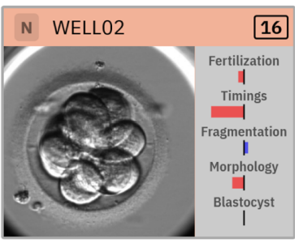
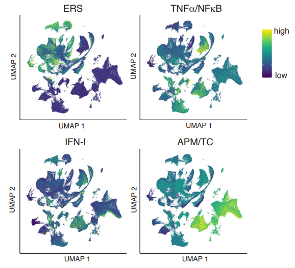
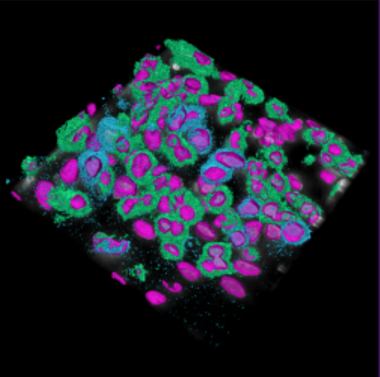
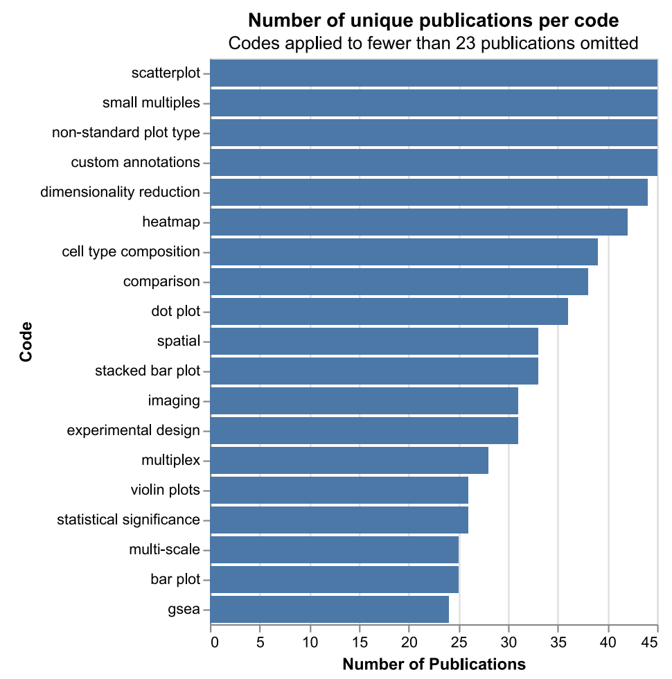
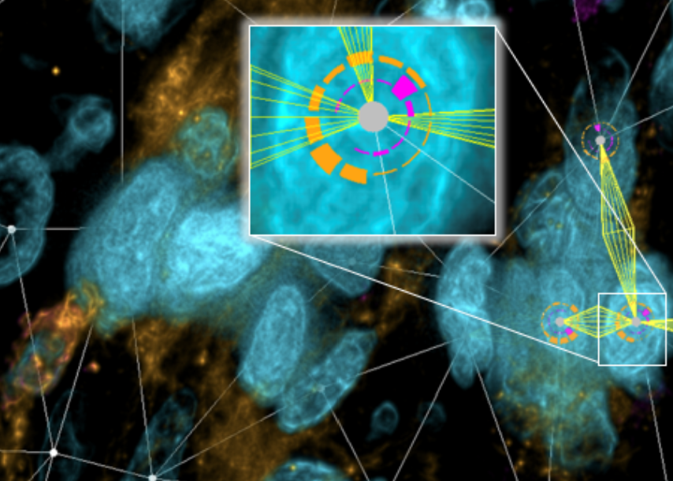

A full list of my publications and citation statistics can be found on my <a href="https://scholar.google.com/citations?user=UHmEAooAAAAJ" target="_blank"><u>Google Scholar</u></a> page.

Journal Publications
------

     

        
    

    

     Knittel, Johannes; Warchol, Simon; Troidl, Jakob; Brumar, Camelia D.; Yu Yang, Helen; Mörth, Eric; <b>Krüger, Robert</b>; Needleman, Daniel; Ben-Yosef, Dalit; Pfister, Hanspeter. EmbryoProfiler: A Visual Clinical Decision Support System for IVF. IEEE Transaction on Visualization and Computer Graphics 2025. <a href="https://doi.org/10.1109/TVCG.2025.3634780" target="_blank"><u>DOI: 10.1109/TVCG.2025.3634780</u></a>
    

     

        
    

    

     Simada, Kenichi; Michaud, Daniel E; Cui, Yvonne Xiaoyong; Zheng, Kelly; Goldberg, Jonathan; Ju, Zhenlin; Schnitt, Stuart J; Pastorello, Ricardo ; Kania, Lukas D; Hoffer, John ; Muhlich, Jeremy L; Hyun, Nhan; <b>Krueger, Robert</b>; ...; Sorger, Peter K; Agudo, Judith; Mittendorf, Elizabeth A; Guerriero, Jennifer L. An estrogen receptor signaling transcriptional program linked to immune evasion in human hormone receptor-positive breast cancer. bioarchiv (preprint), 2025. <a href="https://doi.org/10.1101/2024.11.23.619172" target="_blank">DOI: <u>10.1101/2024.11.23.619172</u></a>
    

    

    
Simada, Kenichi; Michaud, Daniel E; Cui, Yvonne Xiaoyong; Zheng, Kelly; Goldberg, Jonathan; Ju, Zhenlin; Schnitt, Stuart J; Pastorello, Ricardo ; Kania, Lukas D; Hoffer, John ; Muhlich, Jeremy L; Hyun, Nhan; <b>Krueger, Robert</b>; ...; Sorger, Peter K; Agudo, Judith; Mittendorf, Elizabeth A; Guerriero, Jennifer L. An estrogen receptor signaling transcriptional program linked to immune evasion in human hormone receptor-positive breast cancer. bioarchiv (preprint), 2025. <a href="https://doi.org/10.1101/2024.11.23.619172" target="_blank">DOI: <u>10.1101/2024.11.23.619172</u></a>

    

    
Prabhakaran, Sandhya; Yapp, Clarence; Baker, Gregory J; Beyer, Johanna; Hwan Chang, Young;  Creason, Allison L; <b>Krueger,  Robert</b>; Muhlich, Jeremy; Patterson, Nathan Heath; Sidak, Kevin; Sudar, Damir; Taylor, Adam J; Ternes, Luke; Troidl, Jakob; Xie, Yubin ; Sokolov, Artem; Tyson, Darren R. Addressing Persistent Challenges in Digital Image Analysis of Cancerous Tissues. Molecular Oncology, 2025. <a href="https://doi.org/10.1002/1878-0261.13783" target="_blank">DOI: <u>10.1002/1878-0261.13783</u></a>

    

    
Keller, Mark S; Moerth, Eric; Smits, Thomas C; Warchol, Simon; Wang, Qianwen; <b>Krueger, Robert</b>; Pfister, Hanspeter; Gehlenborg, Nils. The State of Single-Cell Atlas Data Visualization in the Biological Literature. IEEE Computer Graphics and Applications, 2025. <a href="https://doi.org/10.1109/MCG.2025.3583979" target="_blank">DOI: <u>10.1109/MCG.2025.3583979</u></a>

    

    
Moerth, Eric; Sidak, Kevin; Maliga, Zoltan ; Moeller, Torsten; Gehlenborg, Nils; Sorger, Peter; Pfister, Hanspeter; Beyer, Johanna; <b>Krueger, Robert</b>. Cell2Cell: Explorative Cell Interaction Analysis in Multi-Volumetric Tissue Data. Transaction on Visualization and Computer Graphics, 2024. <a href="https://doi.org/10.1109/TVCG.2024.3456406" target="_blank">DOI: <u>10.1109/TVCG.2024.3456406</u></a>

* 
Knittel, Johannes; Warchol, Simon; Troidl, Jakob; Brumar, Camelia D.; Yu Yang, Helen; Mörth, Eric; <b>Krüger, Robert</b>; Needleman, Daniel; Ben-Yosef, Dalit; Pfister, Hanspeter. EmbryoProfiler: A Visual Clinical Decision Support System for IVF. IEEE Transaction on Visualization and Computer Graphics 2025. <a href="https://doi.org/10.1109/TVCG.2025.3634780" target="_blank"><u>DOI: 10.1109/TVCG.2025.3634780</u></a>

* 
Simada, Kenichi; Michaud, Daniel E; Cui, Yvonne Xiaoyong; Zheng, Kelly; Goldberg, Jonathan; Ju, Zhenlin; Schnitt, Stuart J; Pastorello, Ricardo ; Kania, Lukas D; Hoffer, John ; Muhlich, Jeremy L; Hyun, Nhan; <b>Krueger, Robert</b>; Gottlieb, Alexander; Nelson, Adam; Wanderley, Carlos W; Antonellis, Gabriella; McAllister, Sandra S; Tolaney, Sara M; Waks, Adrienne G; Jeselsohn, Rinath; Sorger, Peter K; Agudo, Judith; Mittendorf, Elizabeth A; Guerriero, Jennifer L. An estrogen receptor signaling transcriptional program linked to immune evasion in human hormone receptor-positive breast cancer. bioarchiv (preprint), 2025. <a href="https://doi.org/10.1101/2024.11.23.619172" target="_blank">DOI: <u>10.1101/2024.11.23.619172</u></a>

* 
Prabhakaran, Sandhya; Yapp, Clarence; Baker, Gregory J; Beyer, Johanna; Hwan Chang, Young;  Creason, Allison L; <b>Krueger,  Robert</b>; Muhlich, Jeremy; Patterson, Nathan Heath; Sidak, Kevin; Sudar, Damir; Taylor, Adam J; Ternes, Luke; Troidl, Jakob; Xie, Yubin ; Sokolov, Artem; Tyson, Darren R. Addressing Persistent Challenges in Digital Image Analysis of Cancerous Tissues. Molecular Oncology, 2025. <a href="https://doi.org/10.1002/1878-0261.13783" target="_blank">DOI: <u>10.1002/1878-0261.13783</u></a>

* 
Keller, Mark S; Moerth, Eric; Smits, Thomas C; Warchol, Simon; Wang, Qianwen; <b>Krueger, Robert</b>; Pfister, Hanspeter; Gehlenborg, Nils. The State of Single-Cell Atlas Data Visualization in the Biological Literature. IEEE Computer Graphics and Applications, 2025. <a href="https://doi.org/10.1109/MCG.2025.3583979" target="_blank">DOI: <u>10.1109/MCG.2025.3583979</u></a>

* 
Moerth, Eric; Sidak, Kevin; Maliga, Zoltan ; Moeller, Torsten; Gehlenborg, Nils; Sorger, Peter; Pfister, Hanspeter; Beyer, Johanna; <b>Krueger, Robert</b>. Cell2Cell: Explorative Cell Interaction Analysis in Multi-Volumetric Tissue Data. Transaction on Visualization and Computer Graphics, 2024. <a href="https://doi.org/10.1109/TVCG.2024.3456406" target="_blank">DOI: <u>10.1109/TVCG.2024.3456406</u></a>

* 
Warchol, Simon: Troidl, Jakob; Muhlich, Jeremy L; <b>Krueger, Robert</b>; Hoffer, John; Lin, Tica; Beyer, Johanna; Glassman, Elena; Sorger, Peter Karl; Pfister, Hanspeter. psudo: Exploring Multi-Channel Biomedical Image Data with Spatially and Perceptually Optimized Pseudocoloring. Computer Graphics Forum, 2024. <a href="https://doi.org/10.1111/cgf.15103" target="_blank">DOI: <u>10.1111/cgf.15103</u></a>

* 
Herzberger, Lukas; Hadwiger, Markus; <b>Krüger, Robert</b>; Sorger, Peter; Pfister, Hanspeter; Gröller, Eduard; Beyer. Johanna. Residency Octree: A Hybrid Approach for Scalable Web-Based Multi-Volume Rendering. IEEE Transaction on Visualization and Computer Graphics, 2023. <a href="https://doi.org/10.1109/TVCG.2023.3327193" target="_blank">DOI:  <u>10.1109/TVCG.2023.3327193</u></a>

* 
Warchol, Simon#; <b>Krueger, Robert</b>#; Nirmal, Ajit Johnson; Gaglia, Giorgio; Jessup, Jared; Ritch, Cecily C; Hoffer, John; Muhlich, Jeremy; Burger, Megan; Jacks, Tyler L; Santagata, Sandro; Sorger, Peter K; Pfister, H. Visinity: Visual Spatial Neighborhood Analysis for Multiplexed Tissue Imaging Data. IEEE Transaction and Computer Graphics, 2022. <a href="https://doi.org/10.1101/2022.05.09.490039" target="_blank">DOI: <u>10.1101/2022.05.09.490039</u></a> --# shared first-author

* 
Gaglia, Giorgio; Burger, Megan; Ritch, Cecily C. ; Rammos, Danae; Yang, Dai; Crossland, Grace E.; Tavana, Sara Z, Warchol, Simon; Jaeger, Alex M., Naranjo, Santiago; Coy, Shannon; Nirmal, Ajit J.; <b>Krueger, Robert</b>; Lin, Jia-Ren; Pfister, Hanspeter; Sorger, Peter K; Jacks, Tyler; Santagata, Sandro 2022.Lymphocyte networks are dynamic cellular communities in the immunoregulatory landscape of lung adenocarcinoma., bioRxiv (2022) / under review in CELL <a href="https://doi.org/10.1101/2022.08.11.503237" target="_blank">DOI: <u>10.1101/2022.08.11.503237</u></a>/ under review in Cell Community Press (Cancer Cell, Immunity).

* 
Schapiro, Dennis; Yapp, Clarence; Sokolov, Artem, Reynolds, S.M., Chen, Yu-An, Sudar, Damir, et al., 2022. MITI Minimum Information Guidelines for Highly Multiplexed Tissue Images. Nature Methods, 2022. 19(3), pp.262-267. <a href="https://doi.org/10.1038/s41592-022-01415-4" target="_blank">DOI: <u>10.1038/s41592-022-01415-4</u></a>

* 
Yang, Yalong; Xia, Wenyu; Lekschas, Fritz; Nobre, Caroline; <b>Krueger, Robert</b>; Pfister, Hanspeter. "The Pattern is in the Details: An Evaluation of Interaction Techniques for Locating, Searching, and Contextualizing Details in Multivariate Matrix Visualizations". Proceedings of the 2022 CHI Conference on Human Factors in Computing Systems (CHI), 2022., <a href="https://dl.acm.org/doi/10.1145/3491102.3517673" target="_blank">DOI: 10.1145/3491102.3517673</a>

* 
Rashid, Rumana; Chen, Yu-An; Hoffer, John; Muhlich, Jeremy; Lin, Jia-Ren; <b>Krueger, Robert</b>; Pfister, Hanspeter ; Mitchell, Richard ; Santagata, Sandro ; Sorger, Peter K. "Narrative online guides for the interpretation of digital-pathology images and tissue-atlas data.".ature Biomedical Engineering 6, no. 5 (2022): 515-526., <a href="https://doi.org/10.1038/s41551-021-00789-8" target="_blank">DOI: <u>10.1038/s41551-021-00789-8</u></a>

* 
Strobelt, Hendrik; Jambay, Kinley; <b>Krueger, Robert</b>; Beyer, Johanna; Pfister, Hanspeter; Rush, Alexander M. "GenNI: Human-AI Collaboration for Data-Backed Text Generation". IEEE Transaction on Visualization and Computer Graphics. 2021 Oct 4, <a href="https://doi.org/10.1109/TVCG.2021.3114845" target="_blank">DOI: <u>10.1109/TVCG.2021.3114845</u></a>

* 
Jessup, Jared#; <b>Krueger, Robert</b>#; Warchole, Simon; Hoffer, John; Muhlich, Jeremy; Ritch, Cecily C; Gaglia, Giorgio; Coy, Shannon; Chen, Yu-An; Lin, Jia-Ren; Santagata, Sando; Sorger, Peter K.; Pfister, Hanspeter. "Scope2Screen: Focus+Context Techniques for Pathology TumorAssessment in Multivariate Image Data". IEEE Transaction on Visualization and Computer Graphics. 2021 Oct 4, <a href="https://doi.org/10.1109/TVCG.2021.3114786" target="_blank">DOI: <u>10.1109/TVCG.2021.3114786</u></a>--# shared first-author

* 
Rozenblatt-Rosen, Orit et al. "The Human Tumor Atlas Network: charting tumor transitions across space and time at single-cell resolution." Cell 181.2 (2020): 236-249. <a href="https://doi.org/10.1016/j.cell.2020.03.053" target="_blank">DOI: <u>10.1016/j.cell.2020.03.053</u></a>

* 
Hoffer, John; Rashid, Rumana ; Muhlic, Jeremy L ; Chen, Yu-An. ; Russell, Douglas Peter William ; Ruokonen, Juha ; <b>Krueger, Robert</b> ; Pfister, Hanspeter ; Santagata, Sandro ; Sorger, Peter K. "Minerva: a light-weight, narrative image browser for multiplexed tissue images." Journal of Open Source Software. 2020 Oct 15;5(54):2579, <a href="https://doi.org/10.21105/joss.02579" target="_blank">DOI: <u>10.21105/joss.02579</u></a>

* 
Rashid, Rumana; Chen, Yu-An ; Hoffer, John ; Muhlich, Jeremy L. ; Lin, Jia-Ren ; <b>Krueger, Robert</b> ; Pfister, Hanspeter ; Mitchell, Richard ; Santagata, Sandro ; Sorger, Peter K.. "Online Narrative Guides for Illuminating Tissue Atlas Data and Digital Pathology Images." bioRxiv (2020) - under review, <a href="https://www.biorxiv.org/content/10.1101/2020.03.27.001834v2.full.pdf" target="_blank"><u>preprint on arXiv</u></a>

* 
Rashid, Rumana ; Chen, Yu-An ; Hoffer, John ; Muhlich, Jeremy L. ; Lin, Jia-Ren ; <b>Krüger Robert</b> ; Pfister, Hanspeter ; Mitchell, Richard ; Santagata, Sandro ; Sorger, Peter K. "Interpretative Guides for Interacting with Tissue Atlas and Digital Pathology Data using the Minerva Browser." bioRxiv - under review (2020), <a href="https://www.biorxiv.org/content/10.1101/2020.03.27.001834v1.full.pdf" target="_blank"><u>preprint on arXiv</u></a>

* 
Gehrmann, Sebastian ; Strobelt , Hendrik ; <b>Krüger , Robert</b> ; Pfister , Hanspeter ; Rush , Alexander M: Visual Interaction with Deep Learning Models through Collaborative Semantic Inference. In: Transaction on Visualization and Computer Graphics (TVCG), 2019, <a href="https://arxiv.org/pdf/1907.10739.pdf" target="_blank"><u>preprint on arXiv</u></a>

* 
<b>Krüger, Robert</b> ; Beyer , Johanna ; Jang , Won-Dong ; Kim , Nam Wook ; Sokolov, Arten ; Sorger , Peter K. ; Pfister , Hanspeter: Facetto: Combining Unsupervised and Supervised Learning for Hierarchical Phenotype Analysis in Multi-Channel Image Data. In: Transaction on Visualization and Computer Graphics (TVCG), 2019, <a href="https://doi.org/10.1101/722918" target="_blank"><u>preprint on biorXiv</u></a>

* 
<b>Krüger, Robert</b> ; Qi, Han ; Ivanov, Nikolay ; Mahtal, Sanae ; Thom, Dennis ; Pfister, Hanspeter ; Ertl, Thomas: Bird’s-Eye - Large-Scale Visual Analytics of City Dynamics using Social Location Data. In: Computer Graphics Forum (CGF) (proceedings of The Eurographics Conference on Visualization), Bd. 2019, <a href="https://doi.org/10.1111/cgf.13713" target="_blank">DOI: <u>10.1111/cgf.13713</u></a>

* 
<b>Krueger, Robert</b> ; Simeonov, Georgi ; Beck, Fabian ; Ertl, Thomas: Visual Interactive Map Matching. In: Transaction on Visualization and Computer Graphics (TVCG), Bd. 24 (2018), Nr. 6. <b>(PacificVis Honorable Mention)</b>, <a href="https://doi.org/10.1109/TVCG.2018.2816219" target="_blank">DOI: <u>10.1109/TVCG.2018.2816219</u></a>

* 
Steptoe, Michael ; <b>Krüger, Robert</b> ; Garcia, Rolando ; Liang, Xing ; Maciejewski, Ross: A Visual Analytics Framework for Exploring Theme Park Dynamics. In: ACM Transaction on Interactive Intelligent Systems. Bd. 8 (2018), Nr. 4., <a href="https://doi.org/10.1109/VAST.2015.7347639" target="_blank">DOI: <u>10.1109/VAST.2015.7347639</u></a>

* 
Thom, Dennis ; <b>Krüger, Robert</b> ; Ertl, Thomas: Can Twitter Save Lives? A Broad-scale Study on Visual Social Media Analytics for Public Safety. In: IEEE Transactions on Visualization and Computer Graphics (TVCG), Bd. 22 (2016), Nr. 7, <a href="https://doi.org/10.1109/TVCG.2015.2511733" target="_blank">DOI: <u>10.1109/TVCG.2015.2511733</u></a>

* 
Haag, Florian ; <b>Krüger, Robert</b> ; Ertl, Thomas: Visual Querying of Semantically Enriched Movement Data. In: Computer Vision, Imaging and Computer Graphics – Theory and Applications: International Joint Conference, VISIGRAPP 2016, 11. Aufl. : Springer International Publishing, 2016, <a href="https://link.springer.com/chapter/10.1007/978-3-319-64870-5_12" target="_blank">ISBN: <u>978-3-319-64870-5</u></a>

* 
<b>Krüger, Robert</b> ; Thom, Dennis ; Ertl, Thomas: Semantic Enrichment of Movement Behavior with Foursquare – A Visual Analytics Approach. In: IEEE Transactions on Visualization and Computer Graphics (TVCG), Bd. 21 (2015), Nr. 8, <a href="https://doi.org/10.1109/TVCG.2014.2371856" target="_blank">DOI: <u>10.1109/TVCG.2014.2371856</u></a>

* 
Bosch, Harald ; Thom, Dennis ; Heimerl, Florian ; Püttmann, Edwin ; Koch, Steffen ; <b>Krüger, Robert</b> ; Wörner, Michael ; Ertl, Thomas: ScatterBlogs2: Real-Time Monitoring of Microblog Messages Through User-Guided Filtering. In: IEEE Transactions on Visualization and Computer Graphics (TVCG). Bd. 19 (2013), Nr. 12, <a href="https://doi.org/10.1109/TVCG.2013.186" target="_blank">DOI: <u>10.1109/TVCG.2013.186</u></a>

* 
<b>Krüger, Robert</b> ; Thom, Dennis ; Wörner, Michael ; Bosch, Harald ; Ertl, Thomas: TrajectoryLenses – A Set-based Filtering and Exploration Technique for Long-term Trajectory Data. In: Computer Graphics Forum (CGF) (proceedings of The Eurographics Conference on Visualization), Bd. 2013, Nr. 3, <a href="https://doi.org/10.1111/cgf.12132" target="_blank">DOI: <u>10.1111/cgf.12132</u></a>

Conference Publications
------

* 
Behrisch, Michael ; <b>Krueger, Robert</b> ; Lekschas, Fritz ; Schreck, Tobias ; Gehlenborg, Nils ; Pfister, Hanspeter: Visual Pattern-Driven Exploration of Big Data. In: IEEE Big Data Visual Analytics (BDVA) 2018 <a href="https://arxiv.org/abs/1807.01364" target="_blank"> <u>arXiv preprint arXiv:1807.01364</u></a>

* 
Herr, Dominik ; Reinhardt, Jan ; Reina, Guido; <b>Krueger, Robert</b> ; Ferrari, Rafael Villanueva ; Ertl, Thomas: Immersive Modular Factory Layout Planning using Augmented Reality, In: CIRP-CMS 2018 <a href="https://doi.org/10.1016/j.procir.2018.03.200" target="_blank">DOI: <u>10.1016/j.procir.2018.03.200</u></a>

* 
<b>Krueger, Robert</b> ; Tremel, Tina ; Thom, Dennis: VESPA 2.0: Data-Driven Behavior Models for Visual Analytics of Movement Sequences. In: IEEE International Symposium on Big Data Visual Analytics (BDVA), 2017 <b>(Best Paper Award)</b> <a href="https://doi.org/10.1109/BDVA.2017.8114626" target="_blank">DOI: <u>10.1109/BDVA.2017.81146262</u></a>

* 
Haag, Florian ; <b>Krüger, Robert</b> ; Ertl, Thomas: VESPa: A Pattern-Based Visual Query Language for Event Sequences. In: Proceedings of the 7th International Conference on Information Visualization Theory and Applications (IVAPP 2016), Bd. 7, 2016 <b>(Best Paper Award)</b>, DOI: <a href="https://doi.org/10.5220/0005716900480059" target="_blank"><u>10.5220/0005716900480059</u></a>

* 
<b>Krüger, Robert</b> ; Sun, Guodao ; Beck, Fabian ; Liang, Ronghua ; Ertl, Thomas: TravelDiff: Visual Comparison Analytics for Massive Movement Patterns Derived from Twitter. In: IEEE Pacific Visualization Symposium (PacificVis), Bd. 9, 2016, DOI: <a href="https://doi.org/10.1109/PACIFICVIS.2016.7465266" target="_blank"><u>10.1109/PACIFICVIS.2016.7465266</u></a>

* 
Bosch, Harald ; <b>Krüger, Robert</b> ; Thom, Dennis: Data-Driven Exploration of Real-Time Geospatial Text Streams. In: Bifet, A. ; May, M. ; Zadrozny, B. ; Gavalda, R. ; Pedreschi, D. ; Bonchi, F. ; Cardoso, J. ; Spiliopoulou, M. In: Machine Learning and Knowledge Discovery in Databases: ECML PKDD 2015 Proceedings, M, Springer International Publishing (2015), DOI: <a href="https://doi.org/10.1007/978-3-319-23461-8_14" target="_blank"><u>10.1007/978-3-319-23461-8_14</u></a>

* 
Thom, Dennis ; <b>Krüger, Robert</b> ; Bechstedt, Ulrike ; Platz, Axel ; Zisgen, Julia ; Volland, Bernd ; Ertl, Thomas: Can Twitter really save your Life? A Case Study of Visual Social Media Analytics for Situation Awareness. In: IEEE Pacific Visualization Symposium (PacificVis), Bd. 2015, DOI: <a href="https://doi.org/10.1109/PACIFICVIS.2015.7156376" target="_blank"><u>10.1109/PACIFICVIS.2015.7156376</u></a>

* 
Thom, Dennis ; Bosch, Harald ; <b>Krüger, Robert</b> ; Ertl, Thomas: Using Large Scale Aggregated Knowledge for Social Media Location Discovery. In: Hawaii International Conference on System Sciences (HICSS-47), Hawaii International Conference on System Sciences (HICSS-47). Bd. 47, 2014, DOI: <a href="https://doi.org/10.1109/HICSS.2014.189" target="_blank"><u>10.1109/HICSS.2014.189</u></a>

* 
<b>Krüger, Robert</b> ; Thom, Dennis ; Ertl, Thomas: Visual Analysis of Movement Behavior using Web Data for Context Enrichment. In: IEEE Pacific Visualization Symposium (PacificVis), Bd. 7, 2014 <b>(Best Paper Award)</b>, DOI: <a href="https://doi.org/10.1109/PacificVis.2014.57" target="_blank"><u>10.1109/PacificVis.2014.57</u></a>

* 
Lu, Yafeng ; <b>Krüger, Robert</b> ; Thom, Dennis ; Wang, Feng ; Koch, Steffen ; Ertl, Thomas ; Maciejewski, Ross: Integrating Predictive Analytics and Social Media. In: IEEE Conference on Visual Analytics Science and Technology (VAST), Bd. 2014, DOI: <a href="http://doi.acm.org/10.1145/3162076" target="_blank"><u>10.1145/3162076</u></a>

Workshop Publications
------

* 
Kalsi, Chahat ; Shen, Yuancheng ; Gaupp, Sophia ; Reichmann, Luca ; Rogava, Meri ; Krone, Michael  ; Boorboor, Saeed ; Krüger, Robert: BioSET – Biomarker-based Spatial co-Expression analysis in Tumor environments. Workshop Bio+MedVis Challenge @ IEEE VIS 2025, <a href="https://chahat08.github.io/assets/papers/bioset/BioSET.pdf" target="_blank"><u>link</u></a>

* 
Herr, Dominik ; Reinhardt, Jan ; <b>Krüger, Robert</b> ; Reina, Guido ; Ertl, Thomas: Immersive Visual Analytics for Modular Factory Layout Planning. In: IEEE Workshop on Immersive Analytics, Workshop on Immersive Analytics : IEEE, 2017, <a href="http://www.aviz.fr/~bbach/immersive2017/papers/IA_2278-paper.pdf" target="_blank"><u>link</u></a>

* 
Lischke, Lars ; Hoffmann, Jan ; <b>Krüger, Robert</b> ; Bader, Patrick ; Woźniak, Paweł W. ; Schmidt, Albrecht: Towards Interaction Techniques for Social Media Data Exploration on Large High-Resolution Displays. In: ACM: Proceedings of the 2017 Conference on Human Factors in Computing Systems (CHI EA’17), ACM 2017. — Rezensiertes Poster, <a href="http://doi.acm.org/10.1145/3027063.3053229" target="_blank">DOI: <u>10.1145/3027063.3053229</u></a>

* 
Tobien, Patrick ; Lischke, Lars ; Hirsch, Marco ; <b>Krüger, Robert</b> ; Lukowicz, Paul ; Schmidt, Albrecht: Engaging People to Participate in Data Collection. In: UbiComp ’16 Proceedings EA, 2016. — Rezensiertes Poster, DOI: <a href="https://doi.org/10.1145/2968219.2971420" target="_blank"><u>10.1145/2968219.2971420</u></a>

* 
<b>Krüger, Robert</b> ; Koch, Steffen ; Ertl, Thomas: SaccadeLenses: Interactive Exploratory Filtering of Eye Tracking Trajectories. In: IEEE Second Workshop on Eye Tracking and Visualization, Bd. 2 : IEEE, 2016, DOI: <a href="https://doi.org/10.1109/ETVIS.2016.7851162" target="_blank"><u>10.1109/ETVIS.2016.7851162</u></a>

* 
Steptoe, Michael ; <b>Krüger, Robert</b> ; Zhang, Yifan ; Liang, Xing ; Garcia, Rolando ; Kadambi, Sagarika ; Luo, Wei ; Ertl, Thomas ; Maciejewski, Ross: VAST Challenge 2015: Grand Challenge – Team VADER/VIS Award for Outstanding Comprehensive Submission. In: IEEE Conference on Visual Analytics Science and Technology (VAST), VAST Challenge, 2015 <b>(Award)</b>,  DOI: <a href="https://doi.org/10.1109/VAST.2015.7347639" target="_blank"><u>10.1109/VAST.2015.7347639</u></a>

* 
<b>Krüger, Robert</b> ; Herr, Dominik ; Haag, Florian ; Ertl, Thomas: Inspector-Gadget: Integrating Data Preprocessing and Orchestration in the Visual Analysis Loop. In: International Workshop on Visual Analytics EuroVA, International Workshop on Visual Analytics EuroVA, 2015, DOI: <a href="http://dx.doi.org/10.2312/eurova.20151096" target="_blank"><u>10.2312/eurova.20151096</u></a>

* 
Stoll, Michael ; <b>Krüger, Robert</b> ; Ertl, Thomas ; Bruhn, Andrés: Racecar Tracking and its Visualization Using Sparse Data. In: 1st IEEE VIS Workshop on Sports Data Visualization, Bd. 2013

* 
Jäckle, Dominik ; Bosch, Harald ; Thom, Dennis ; <b>Krüger, Robert</b> ; Keim, Daniel A. ; Ertl, Thomas: Visual Analysis of Social Media Data in Emergency Situations by Aggregating Annotated User Movements. In: ISCRAM: 10th International Conference on Information Systems for Crisis Response and Management, Bd. 2013. — Reviewed Poster

* 
<b>Krüger, Robert</b> ; Bosch, Harald ; Thom, Dennis ; Püttmann, Edwin ; Han, Qi ; Koch, Steffen ; Heimerl, Florian ; Ertl, Thomas: Prolix – Visual Prediction Analysis for Box Office Success. In: IEEE Conference on Visual Analytics Science and Technology (VAST), 2013 <b>(Honorable Mention)</b> <a href="https://www.researchgate.net/profile/R_Krueger/publication/260864010_Prolix-Visual_Prediction_Analysis_for_Box_Office_Success/links/575d360f08aec91374ae7a6a/Prolix-Visual-Prediction-Analysis-for-Box-Office-Success.pdf"  target="_blank"><u>link</u></a>

  
* 
<b>Krüger, Robert</b> ; Bosch, Harald ; Koch, Steffen ; Müller, Christoph ; Reina, Guido ; Thom, Dennis ; Ertl, Thomas: HIVEBEAT – A Highly Interactive Visualization Environment for Broad-Scale Exploratory Analysis and Tracing. In: IEEE Conference on Visual Analytics Science and Technology (VAST), Bd. 2012 <b>(Honorable Mention)</b>, DOI: <a href="https://doi.org/10.1109/VAST.2012.6400518" target="_blank"><u>10.1109/VAST.2012.6400518</u></a>

* 
<b>Krüger, Robert</b> ; Lohmann, Steffen ; Thom, Dennis ; Bosch, Harald ; Ertl, Thomas: Using Social Media Content in the Visual Analysis of Movement Data. In: 2nd Workshop on Interactive Visual Text Analytics, 2nd Workshop on Interactive Visual Text Analytics, 2012 <a href="https://pdfs.semanticscholar.org/37cd/b884f87c031ecebbb82ed2aa279a497a58b5.pdf" target="_blank"><u>link</u></a>

Dissertation
------

* 
<b>Krüger, Robert</b>: Visual Analytics of Human Mobility Behavior, 2017, <a href="https://elib.uni-stuttgart.de/bitstream/11682/9733/3/dissertation_krueger_robert.pdf" target="_blank"><u>link</u></a>, DOI: <a href="http://dx.doi.org/10.18419/opus-9716" target="_blank"><u>10.18419/opus-9716</u></a>

